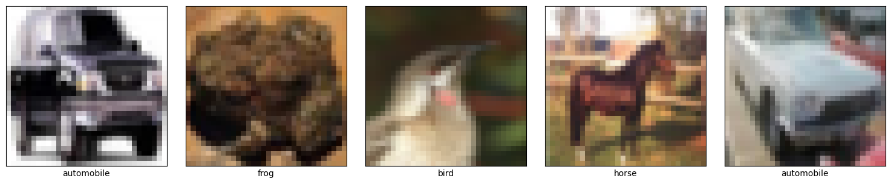
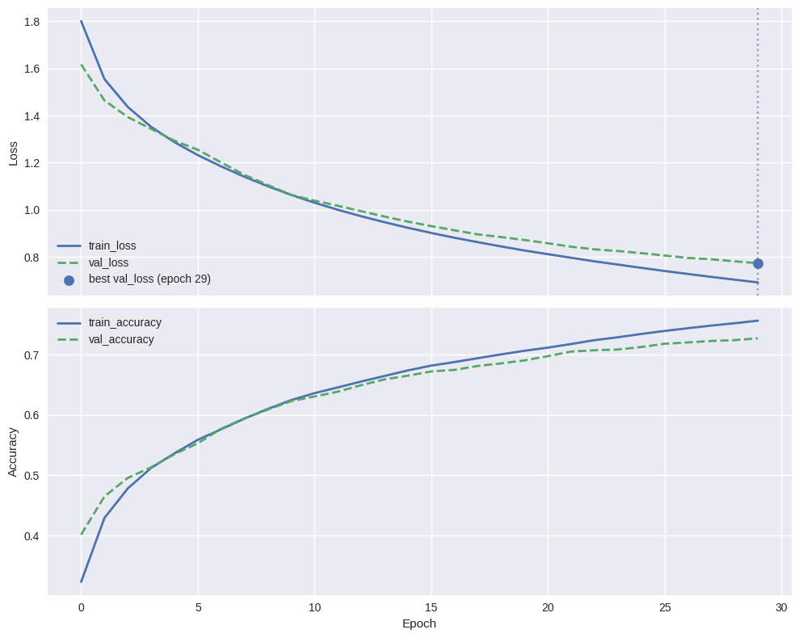
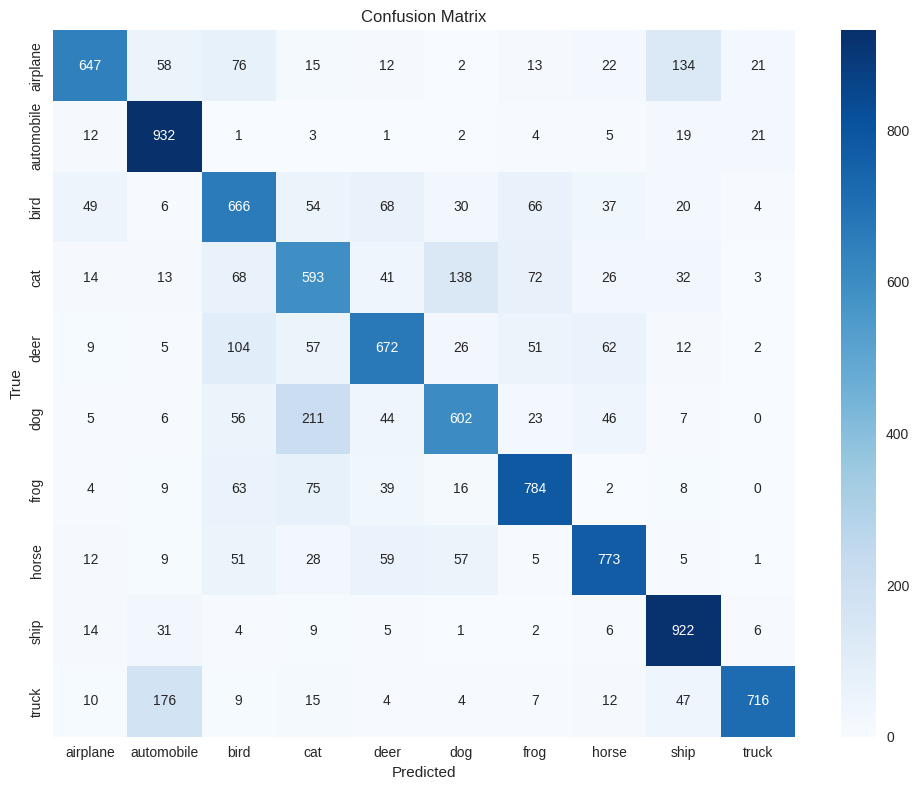
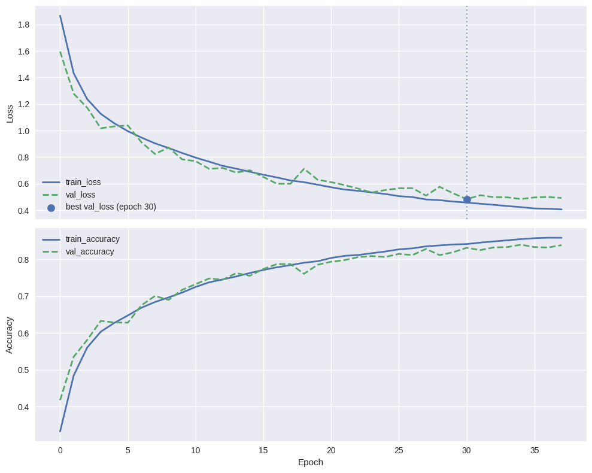
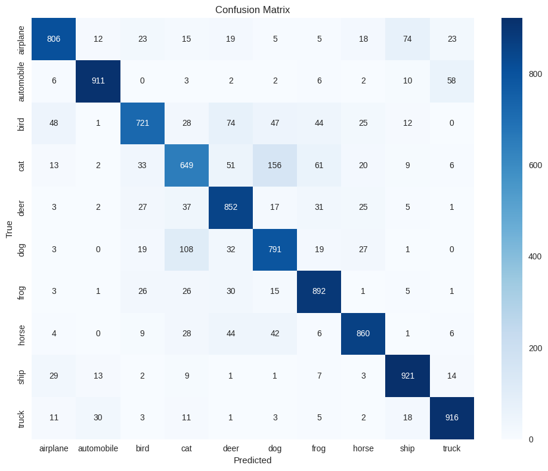
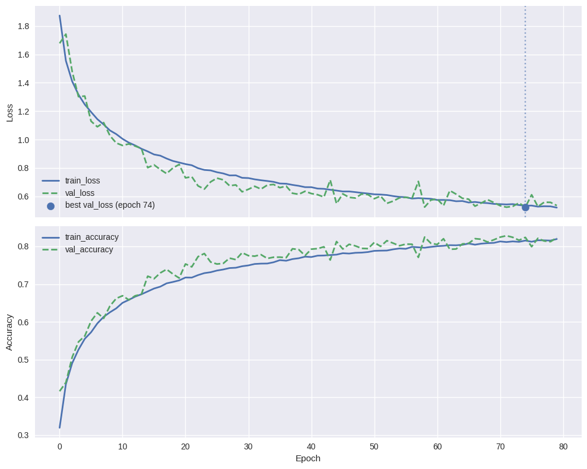
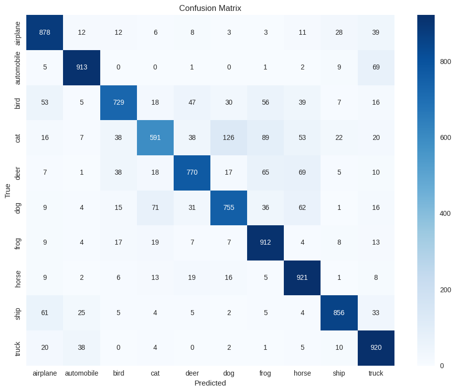

# CIFAR-10 Image Classification with CNNs

A progressive deep learning project that trains and compares three CNN architectures on the CIFAR-10 dataset — starting from a simple baseline and evolving toward a deeper network with data augmentation. Built for Google Colab with GPU support and a custom resumable training utility.

---

## Table of Contents

- [Project Overview](#project-overview)
- [Dataset](#dataset)
- [Project Structure](#project-structure)
- [Setup & How to Run](#setup--how-to-run)
- [Model Architectures](#model-architectures)
  - [Baseline Model](#baseline-model)
  - [Model 1 — BatchNorm + Dropout](#model-1--batchnorm--dropout)
  - [Model 2 — Data Augmentation + Deeper Architecture](#model-2--data-augmentation--deeper-architecture)
- [Training Infrastructure](#training-infrastructure)
  - [ResumableTrainer](#resumabletrainer)
  - [Helper Utilities](#helper-utilities)
- [Results](#results)
- [Visualizations](#visualizations)

---

## Project Overview

This project explores how incremental architectural improvements affect classification performance on CIFAR-10. Three models are trained and compared:

| Model | Key Features |
|---|---|
| Baseline | Simple CNN, no regularization |
| Model 1 | Batch Normalization + Dropout |
| Model 2 | Data Augmentation + Deeper (256-filter) architecture |

All models use **AdamW** optimizer, **sparse categorical crossentropy** loss, and are trained with **early stopping** and **best-model checkpointing** via the custom `ResumableTrainer`.

---

## Dataset

**CIFAR-10** — 60,000 color images (32×32 px) across 10 classes.

| Split | Size | Ratio |
|---|---|---|
| Train | 45,000 | 90% of original train |
| Validation | 5,000 | 10% of original train (stratified) |
| Test | 10,000 | Fixed CIFAR-10 test set |

**Classes:** airplane, automobile, bird, cat, deer, dog, frog, horse, ship, truck

Pixel values are normalized to `[0, 1]` by dividing by 255.

---

## Project Structure

```
cifar-10/
│
├── Cifar10_CNN_output_cleared.ipynb   # Main notebook
├── helper_cifar10.py                  # Plotting & evaluation utilities
├── resumable_trainer.py               # Resumable training utility
│
├── models/
│   ├── baseline_best.keras            # Best saved baseline model
│   ├── model_1_best.keras             # Best saved Model 1
│   └── model_2_best.keras             # Best saved Model 2
│
└── plots/
    ├── sample_images.png
    ├── baseline_training_curve.png
    ├── baseline_confusion_matrix.png
    ├── model1_training_curve.png
    ├── model1_confusion_matrix.png
    ├── model2_training_curve.png
    └── model2_confusion_matrix.png
```

---

## Setup & How to Run

### 1. Open in Google Colab

This project is designed to run on **Google Colab with a T4 GPU**.

> Runtime → Change runtime type → GPU (T4)

### 2. Mount Google Drive

```python
from google.colab import drive
drive.mount('/content/drive')
```

Checkpoints and training logs are saved to:
```
/content/drive/MyDrive/Colab_Experiments/Cifar_10/
```

### 3. Helper scripts are auto-downloaded

The notebook automatically fetches `helper_cifar10.py` and `resumable_trainer.py` from GitHub:

```python
import urllib.request

files = {
    "helper_cifar10.py":    "https://raw.githubusercontent.com/narendrapatel6321-dotcom/cifar_10/main/helper_cifar10.py",
    "resumable_trainer.py": "https://raw.githubusercontent.com/narendrapatel6321-dotcom/cifar_10/main/resumable_trainer.py",
}
for filename, url in files.items():
    urllib.request.urlretrieve(url, filename)
```

### 4. Install dependencies

All required libraries come pre-installed in Colab. For local use:

```bash
pip install tensorflow scikit-learn matplotlib seaborn pandas numpy
```

### 5. Run the notebook top to bottom

Each section is self-contained. If your Colab session disconnects, simply re-run — `ResumableTrainer` will automatically resume from the last saved checkpoint.

---

## Model Architectures

### Baseline Model

A minimal CNN with no regularization — used as the performance reference.

| Layer | Details |
|---|---|
| Input | 32 × 32 × 3 |
| Conv2D × 2 | 32 filters, 3×3, ReLU, He normal |
| MaxPooling2D | 2×2 |
| Conv2D × 2 | 64 filters, 3×3, ReLU, He normal |
| GlobalAveragePooling2D | — |
| Dense | 64 units, ReLU |
| Dense (output) | 10 units, Softmax |

- **Optimizer:** AdamW (lr=3e-4, weight_decay=1e-4)
- **Epochs:** up to 30 (early stopping, patience=5)

---

### Model 1 — BatchNorm + Dropout

Adds Batch Normalization and progressive Dropout to reduce overfitting.

| Block | Layers | Dropout |
|---|---|---|
| Block 1 | Conv-BN-ReLU × 2, 32 filters, MaxPool | 0.2 |
| Block 2 | Conv-BN-ReLU × 2, 64 filters, MaxPool | 0.3 |
| Block 3 | Conv-BN-ReLU × 2, 128 filters, MaxPool | 0.4 |
| Head | GAP → Dense(128)-BN-ReLU → Dropout(0.5) → Dense(10) | — |

- **Optimizer:** AdamW (lr=3e-4, weight_decay=1e-4)
- **Epochs:** up to 50 (early stopping, patience=7)

---

### Model 2 — Data Augmentation + Deeper Architecture

Adds online data augmentation and a 4th conv block with 256 filters.

**Augmentation pipeline (applied during training only):**
- Random horizontal flip
- Random rotation (±10%)
- Random zoom (±10%)

| Block | Layers | Dropout |
|---|---|---|
| Augmentation | RandomFlip, RandomRotation, RandomZoom | — |
| Block 1 | Conv-BN-ReLU × 1, 32 filters, MaxPool | 0.2 |
| Block 2 | Conv-BN-ReLU × 2, 64 filters, MaxPool | 0.3 |
| Block 3 | Conv-BN-ReLU × 2, 128 filters, MaxPool | 0.4 |
| Block 4 | Conv-BN-ReLU × 2, 256 filters, MaxPool | 0.4 |
| Head | GAP → Dense(128)-BN-ReLU → Dropout(0.3) → Dense(10) | — |

- **Optimizer:** AdamW (lr=3e-4, weight_decay=1e-4)
- **Epochs:** up to 80 (early stopping, patience=15)

---

## Training Infrastructure

### ResumableTrainer

`resumable_trainer.py` is a custom training utility built for Colab's session time limits. It makes training crash-safe and resumable across sessions.

**Features:**
- Auto-detects and resumes from the latest valid epoch checkpoint
- Persists full training state (epoch, best metric, patience counter) to JSON after every epoch
- `StatefulEarlyStopping` — patience counter carries over across sessions, so disconnections don't reset your early stopping progress
- Per-epoch `.keras` checkpoints + separate best-model checkpoint
- CSV logging with append mode (logs survive across sessions)
- Atomic state saves (`.tmp` → rename) to prevent corruption on crash

**Usage:**
```python
trainer = ResumableTrainer(
    project_name="Cifar_10",
    experiment_name="model_1",
    model_fn=create_model1,
    monitor="val_loss",
    mode="min",
    patience=7
)

trainer.fit((x_train, y_train), (x_val, y_val), epochs=50)

best_model = trainer.load_best_model()
trainer.get_training_summary()
```

Checkpoints are saved to:
```
/content/drive/MyDrive/Colab_Experiments/Cifar_10/<experiment_name>/
    ├── <name>_best.keras
    ├── <name>_epoch_0001.keras
    ├── training_log.csv
    └── training_state.json
```

---

### Helper Utilities

`helper_cifar10.py` provides two functions used throughout the notebook:

**`plot_training_curve(csv_path)`**
Plots train vs. validation loss and accuracy from the CSV log. Marks the best validation loss epoch with a vertical line.

**`evaluate_model(model, x_test, y_test, class_names)`**
Prints test loss, test accuracy, a full per-class classification report, and renders a confusion matrix heatmap.

---

## Results

| Model | Test Accuracy | Test Loss |
|---|---|---|
| Baseline | 73.07% | 0.7738 |
| Model 1 — BN + Dropout | **83.19%** | **0.4918** |
| Model 2 — Augmentation + Deeper | 82.45% | 0.5221 |

> Model 1 achieves the best test accuracy and lowest loss. Model 2, despite being deeper with data augmentation, performs slightly below Model 1 — likely due to the harder optimization landscape and may benefit from more epochs or tuning.

---

### Per-Class F1-Score Breakdown

| Class | Baseline | Model 1 | Model 2 |
|---|---|---|---|
| airplane | 0.73 | 0.84 | 0.85 |
| automobile | 0.83 | 0.92 | 0.91 |
| bird | 0.63 | 0.77 | 0.78 |
| cat | 0.58 | 0.68 | 0.68 |
| deer | 0.69 | 0.81 | 0.80 |
| dog | 0.64 | 0.76 | 0.77 |
| frog | 0.77 | 0.86 | 0.84 |
| horse | 0.78 | 0.87 | 0.85 |
| ship | 0.84 | 0.90 | 0.88 |
| truck | 0.81 | 0.90 | 0.86 |
| **macro avg** | **0.73** | **0.83** | **0.82** |

> `cat` is the hardest class across all models — a well-known challenge in CIFAR-10 due to visual similarity with `dog` and `deer`.

---

## Visualizations

### Sample Training Images



---

### Baseline Model

**Training Curve**


**Confusion Matrix**


---

### Model 1 — BatchNorm + Dropout

**Training Curve**


**Confusion Matrix**


---

### Model 2 — Data Augmentation + Deeper

**Training Curve**


**Confusion Matrix**

